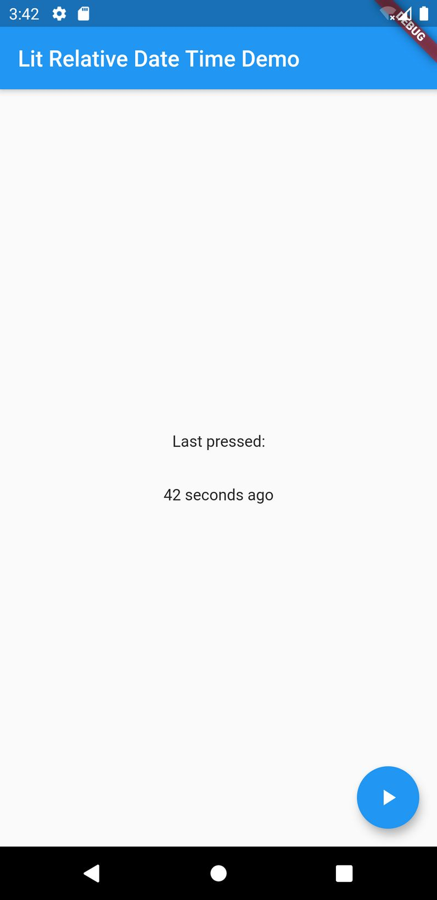

# Lit Relative Date Time

A Flutter package to generate localized relative dates to show differences in time.

## Screenshots

| Difference in seconds (eng. locale)                                                        | Difference in seconds (ger. locale)                                                        |
| ------------------------------------------------------------------------------------------ | ------------------------------------------------------------------------------------------ |
|  |  |

## How it works

## How to use

## Getting Started

This project is a starting point for a Dart
[package](https://flutter.dev/developing-packages/),
a library module containing code that can be shared easily across
multiple Flutter or Dart projects.

For help getting started with Flutter, view our
[online documentation](https://flutter.dev/docs), which offers tutorials,
samples, guidance on mobile development, and a full API reference.

## Example

The `example` folder contains an example app demonstrating the most basic implementation using a local JSON asset file.

## License

The source code of this repository is distributed under the
**BSD 3-Clause** license as specified in the `LICENSE` file.
